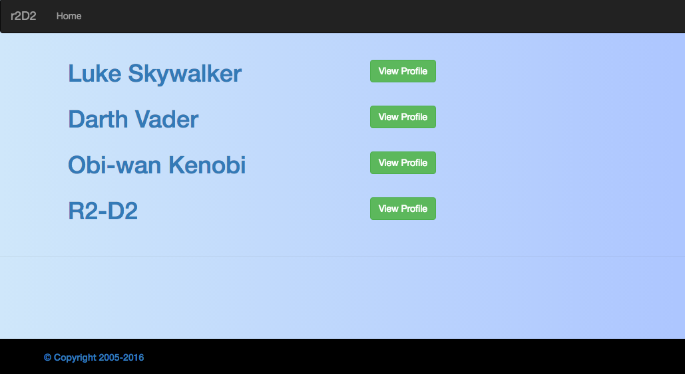
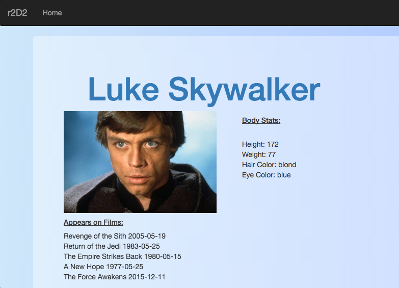
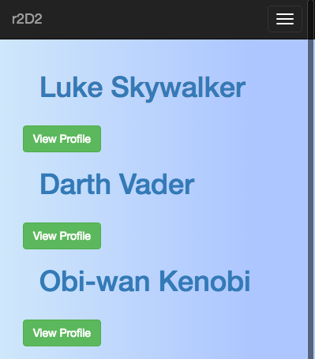

# R2D2
---
AngularJS 1.x Boiler point wrapped on bootstrap, and font-awesome for small front-end views. On the Angular side, We used basic techniques used in Production apps, to be able to consume data using json files. It also mix with Routing and Templates views for easy management...

Mobile version,

